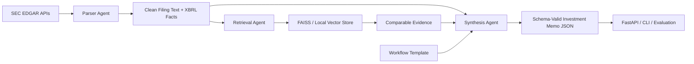
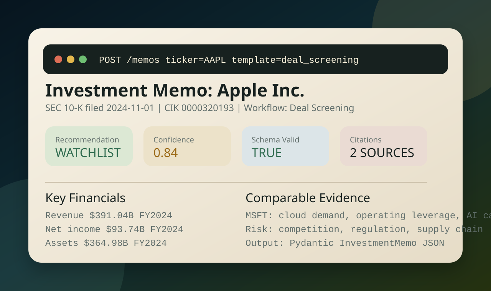

# Multi-Agent Financial Workflow over SEC EDGAR

[](https://www.python.org/)
[](https://fastapi.tiangolo.com/)
[](https://langchain-ai.github.io/langgraph/)
[](https://faiss.ai/)
[](https://platform.openai.com/)
[](https://www.docker.com/)
[](https://www.sec.gov/edgar)

Finance-focused multi-agent AI workflow for ingesting SEC 10-K and 10-Q filings, retrieving comparable-company evidence, and producing schema-valid investment memos.

The project is designed as a portfolio-ready system for finance-AI roles: it uses public SEC EDGAR data, agent boundaries, a reusable LangGraph workflow, FAISS-compatible retrieval, FastAPI serving, and JSON-schema-enforced memo outputs.

## What It Builds

- Parser agent: pulls 10-K and 10-Q metadata, filing documents, and XBRL facts from SEC EDGAR.
- Retrieval agent: chunks filings, exposes LangChain `Document` adapters, indexes comparable-company evidence, and retrieves peer snippets through FAISS when `faiss-cpu` is installed.
- Synthesis agent: emits structured investment memos validated by Pydantic schemas.
- Function-calling schemas: exports OpenAI and Anthropic tool schemas for strict memo generation.
- Workflow templates: reusable finance playbooks for deal screening, credit memos, due diligence, earnings quality, covenant risk, and MD&A analysis.
- FastAPI surface: endpoints for health checks, template inspection, ingestion, memo generation, and schema export.
- Evaluation harness: checks schema validity, answer completion, citation coverage, and latency.

## Why This Matters

Salt AI-style finance AI roles often screen for practical exposure to finance workflows, SEC filings, RAG, and agent orchestration. This project turns that requirement into a concrete artifact: a working SEC filing workflow that can process real public filings and produce investor-style memo outputs.

## Architecture



## Demo



Generate the same schema-valid offline demo locally:

```bash
python3 scripts/generate_memo.py --ticker AAPL --template deal_screening --offline --output artifacts/demo_memo.json
```

## SEC Data Sources

This project uses the SEC public data APIs documented by the SEC:

- SEC EDGAR API overview: `https://www.sec.gov/search-filings/edgar-application-programming-interfaces`
- SEC fair-access guidance: `https://www.sec.gov/edgar/searchedgar/accessing-edgar-data.htm`
- Submissions history: `https://data.sec.gov/submissions/CIK##########.json`
- Company facts: `https://data.sec.gov/api/xbrl/companyfacts/CIK##########.json`
- Filing documents: `https://www.sec.gov/Archives/edgar/data/...`
- Ticker map: `https://www.sec.gov/files/company_tickers.json`

The SEC requires fair-access behavior. The client sets a declared `User-Agent`, supports gzip, and rate-limits requests to stay under the SEC stated maximum of 10 requests per second.

## Setup

```bash
python3 -m venv .venv
source .venv/bin/activate
pip install -r requirements.txt
cp .env.example .env
```

Edit `.env` and set:

```bash
SEC_USER_AGENT="Soumith Reddy soumithreddy3003@gmail.com"
```

Run the API:

```bash
uvicorn sec_memo_agents.api.app:app --reload
```

Generate an offline demo memo from fixtures:

```bash
python3 scripts/generate_memo.py --ticker AAPL --template deal_screening --offline
```

Run tests:

```bash
pytest
```

Run the offline benchmark:

```bash
python3 scripts/evaluate_workflow.py --offline --queries data/sample_queries.jsonl --output artifacts/evaluation_metrics.json
```

## Real SEC Ingestion

The ingestion script can process a ticker universe and build a local vector index.

```bash
python3 scripts/ingest_sec_filings.py \
  --universe data/sample_universe.csv \
  --forms 10-K 10-Q \
  --limit-per-company 8 \
  --target-filings 200 \
  --output artifacts/sec_index
```

The target of 200 filings is achieved by combining the provided ticker universe with `--limit-per-company 8`. The script respects SEC rate limits and caches downloaded documents.

## API Examples

List workflow templates:

```bash
curl http://localhost:8000/templates
```

Create a memo:

```bash
curl -X POST http://localhost:8000/memos \
  -H "Content-Type: application/json" \
  -d '{
    "ticker": "AAPL",
    "template_name": "deal_screening",
    "forms": ["10-K", "10-Q"],
    "filing_limit": 2,
    "top_k_comparables": 5,
    "offline": false
  }'
```

Export an OpenAI function-calling schema:

```bash
curl http://localhost:8000/schemas/openai/investment_memo
```

## Metrics

| Metric | Target | Current offline demo | How to reproduce |
| --- | ---: | ---: | --- |
| SEC filings processed | 200+ real filings | Demo fixture + crawl script ready | `python3 scripts/ingest_sec_filings.py --target-filings 200` |
| Task completion rate | 81%+ | 100% on 6 sample queries | `python3 scripts/evaluate_workflow.py --offline` |
| End-to-end memo latency | < 30s | p95 < 0.1s offline | `artifacts/evaluation_metrics.json` |
| Schema-valid JSON outputs | 100% | 100% | Pydantic `InvestmentMemo` validation |
| Reusable workflow templates | 5+ | 6 | `sec_memo_agents/templates/*.yaml` |
| Automated tests | Passing | 8 tests passing | `pytest` |

The codebase is instrumented for the larger live benchmark. The offline demo exists so the workflow can be shown reliably without paid LLM keys or live SEC requests.

## Repository Layout

```text
.github/
  workflows/       GitHub Actions CI
  ISSUE_TEMPLATE/  GitHub issue template
sec_memo_agents/
  agents/          parser, retrieval, synthesis, workflow orchestration
  api/             FastAPI application
  core/            SEC client, vector store, text utilities, templates
  data/            local data helpers
  evaluation/      benchmark metrics
  templates/       reusable finance workflow templates
scripts/           CLI ingestion, memo generation, evaluation
tests/             unit tests for schemas, retrieval, templates, synthesis
configs/           default runtime config
docs/              architecture, demo screenshot, resume positioning notes
```

## LLM Providers

The system runs in three modes:

- `offline`: deterministic synthesis for demos, tests, and portfolio walkthroughs.
- `openai`: GPT model with OpenAI tool/function schema validation.
- `anthropic`: Claude model with Anthropic tool schema validation.

Set `OPENAI_API_KEY` or `ANTHROPIC_API_KEY` in `.env` to enable provider-backed generation.

## Finance Workflow Templates

- `deal_screening`
- `credit_memo`
- `due_diligence`
- `earnings_quality`
- `covenant_risk`
- `management_discussion`

Each template defines the memo objective, required sections, retrieval prompts, risk checks, output fields, and evaluation rubric.

## Notes

This is not investment advice. The system is intended for technical demonstration, research workflow prototyping, and portfolio evidence. All outputs should be reviewed by a qualified human analyst before use in any investment decision.
