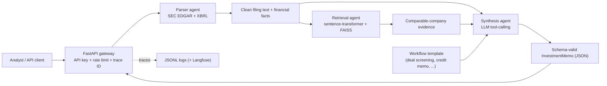

# Multi-Agent Financial Workflow over SEC EDGAR

[](https://www.python.org/)
[](https://fastapi.tiangolo.com/)
[](https://langchain-ai.github.io/langgraph/)
[](https://faiss.ai/)
[](https://platform.openai.com/)
[](https://www.docker.com/)
[](https://www.sec.gov/edgar)

**A finance-domain multi-agent system that pulls real SEC 10-K/10-Q filings, extracts structured financials, finds comparable companies with semantic search, and generates schema-valid investment memos through LLM tool-calling — all behind a hardened API.**

This is the applied, domain-specific counterpart to a general agentic platform: instead of toy tasks, it does real work analysts do — ingest a company's filings (respecting the SEC's fair-access rules), pull its XBRL financials, retrieve peer-company evidence, and produce a structured investment memo. Its **comparable-company retrieval uses real biomedical-grade semantic embeddings** (MRR 1.00 vs 0.32 for keyword matching), and every memo is **guaranteed schema-valid** via Pydantic + LLM tool-calling.

---

## Table of Contents

1. [The Problem](#the-problem)
2. [What This Project Does](#what-this-project-does)
3. [Demo](#demo)
4. [Architecture](#architecture)
5. [How It Works — Concepts Explained](#how-it-works--concepts-explained)
   - [The three agents](#the-three-agents)
   - [SEC EDGAR & fair-access compliance](#sec-edgar--fair-access-compliance)
   - [XBRL — structured financials](#xbrl--structured-financials)
   - [Comparable-company retrieval (semantic RAG)](#comparable-company-retrieval-semantic-rag)
   - [Tool-calling & schema-valid output](#tool-calling--schema-valid-output)
   - [Workflow templates](#workflow-templates)
   - [Offline deterministic mode](#offline-deterministic-mode)
6. [Key Technical Decisions & Tradeoffs](#key-technical-decisions--tradeoffs)
7. [Tech Stack](#tech-stack)
8. [Project Structure](#project-structure)
9. [Getting Started](#getting-started)
10. [API Reference](#api-reference)
11. [Results & Evaluation](#results--evaluation)
12. [Production Hardening & Deployment](#production-hardening--deployment)
13. [Limitations & Future Work](#limitations--future-work)
14. [References & Further Reading](#references--further-reading)

---

## The Problem

An analyst screening a company reads its SEC filings, pulls the key financials, compares it to peers, and writes a memo with a recommendation and risks. It's high-value, repetitive, and slow. Automating it well is hard for reasons that have nothing to do with "calling an LLM":

- SEC EDGAR has **strict fair-access rules** — get them wrong and you're rate-limited or blocked.
- Filings are **messy HTML**; the real financials live in **XBRL** structured data.
- "Find comparable companies" requires **semantic** matching (a bank is like another bank even if the words differ), not keyword overlap.
- The output must be **structured and trustworthy** — a free-text blob isn't consumable by a downstream system, and an analyst won't trust ungrounded claims.

This project handles all four, end to end, as a multi-agent workflow.

## What This Project Does

- **Ingests real SEC filings** — a parser agent resolves a ticker to its SEC CIK, downloads 10-K/10-Q filings with fair-access-compliant rate limiting and caching, cleans the HTML, and extracts XBRL financial facts.
- **Finds comparable companies** — a retrieval agent chunks and embeds filings with a local **sentence-transformer** model for true semantic search, indexed in **FAISS**, and surfaces peer-company evidence.
- **Generates schema-valid memos** — a synthesis agent produces an `InvestmentMemo` validated by **Pydantic**, using **OpenAI/Anthropic tool-calling** schemas (with a deterministic offline fallback).
- **Ships 6 reusable finance playbooks** — deal screening, credit memo, due diligence, earnings quality, covenant risk, MD&A analysis.
- **Serves it behind a hardened API** — API-key auth, rate limiting, trace IDs, JSON logs, optional Langfuse, Docker + Railway/Fly configs.
- **Evaluates honestly** — a retrieval-quality benchmark (semantic vs lexical) and a 50-query agent-quality harness with failure-mode classification.

## Demo


```bash
# Generate a schema-valid memo from bundled fixtures (no API key, no network)
python3 scripts/generate_memo.py --ticker AAPL --template deal_screening --offline

# Or run it against live SEC data (set SEC_USER_AGENT first)
python3 scripts/generate_memo.py --ticker AAPL --template deal_screening
```

## Architecture



Three agents with clean boundaries — **parse → retrieve → synthesize** — coordinated by a workflow runner, fronted by a production API, traced throughout.

## How It Works — Concepts Explained

### The three agents

- **Parser agent** — the data layer. Resolves ticker → CIK, fetches filings and XBRL facts from SEC EDGAR, cleans HTML into analyst-readable text, and segments coarse sections (business, risk factors, MD&A).
- **Retrieval agent** — the comparables layer. Chunks filings, embeds them, indexes them in FAISS, and retrieves the most semantically similar *other* companies' snippets as peer evidence.
- **Synthesis agent** — the reasoning layer. Combines the target filing, its financials, the workflow template, and the retrieved comparables into a structured investment memo via LLM tool-calling (or a deterministic fallback).

### SEC EDGAR & fair-access compliance

SEC EDGAR is the U.S. government's filing system. Its data is free, but the SEC **requires fair-access behavior** — a declared `User-Agent`, gzip support, and staying under **10 requests/second**. This project's `SECClient` implements all of it: a sliding-window rate limiter, the declared user agent, gzip, and on-disk caching keyed by URL (so re-runs don't re-hit the SEC). Getting this right is unglamorous but is exactly the kind of real-world constraint that separates a working system from a notebook.

### XBRL — structured financials

A 10-K's narrative is HTML, but the actual numbers are filed as **XBRL** (eXtensible Business Reporting Language) — machine-readable, tagged financial facts. The parser pulls a company's XBRL "company facts" and extracts standard `us-gaap` line items (revenue, operating income, net income, assets, liabilities, cash, long-term debt), picking the latest 10-K/10-Q value for each. This is how the memo gets *real* financials instead of scraping numbers out of prose.

### Comparable-company retrieval (semantic RAG)

"Find comparable companies" is a **retrieval-augmented generation (RAG)** problem. The naive approach — keyword overlap — fails: two banks described in different words won't match. The fix is **semantic embeddings**: each filing chunk is converted to a vector that captures *meaning*, so companies in the same sector land near each other in vector space even with different wording. Chunks are embedded with a local **sentence-transformer** model and indexed in **FAISS** for fast nearest-neighbor search; the target ticker is excluded so you get *peers*, not itself. A deterministic lexical embedder remains as an offline/CI fallback. (The measured difference is dramatic — see [Results](#results--evaluation).)

### Tool-calling & schema-valid output

A memo a downstream system can consume must be **structured** — not free text. This project defines an `InvestmentMemo` **Pydantic schema** (recommendation, confidence, executive summary, key financials, comparable insights, risks, catalysts, diligence questions, citations) and exports it as an **OpenAI/Anthropic tool-calling schema**. The LLM is forced to "call the tool," so its output *must* conform to the schema — and every result is validated by Pydantic before it's returned. This is how you get reliable structured output from a probabilistic model.

### Workflow templates

Different analyses need different memos. Six **templates** (deal screening, credit memo, due diligence, earnings quality, covenant risk, MD&A analysis) each define the objective, required sections, retrieval prompts, risk checks, and output fields — so the same engine produces the right memo for the task.

### Offline deterministic mode

The whole workflow runs in an **offline mode** that uses bundled fixtures and a deterministic synthesis fallback — no API key, no network. This exists so the system can be demoed, tested, and benchmarked reproducibly. It's the default for CI and quick walkthroughs; live mode (real SEC data + an LLM key) is for production memos.

## Key Technical Decisions & Tradeoffs

| Decision | Alternatives | Why this choice | Tradeoff |
| --- | --- | --- | --- |
| **Local sentence-transformer embeddings** | OpenAI embeddings; keyword search | Free, private, genuinely semantic; huge quality lift over lexical | Slightly heavier dependency than keyword search |
| **Pydantic schema + tool-calling** | Free-text LLM output + parsing | Guaranteed-valid structured memos downstream systems can trust | Constrains output to the schema |
| **XBRL extraction** | Scraping numbers from prose | Accurate, machine-readable financials | Only covers tagged `us-gaap` facts |
| **Fair-access SEC client** (rate limit + cache) | Naive HTTP requests | Won't get blocked; fast re-runs | More client code |
| **Offline deterministic mode** | Always require an LLM key | Reproducible demos/tests/benchmarks with zero setup | Offline numbers reflect templates, not LLM reasoning |
| **3-agent pipeline (not a dynamic agent loop)** | Autonomous tool-use agent | Predictable, debuggable, schema-guaranteed | Less "autonomous" than a free-form agent |

## Tech Stack

| Layer | Tools | Why |
| --- | --- | --- |
| Data | SEC EDGAR APIs, XBRL, `requests` | Real public filings + structured financials |
| Retrieval | sentence-transformers, FAISS | Semantic comparable-company search |
| Synthesis | OpenAI / Anthropic tool-calling, Pydantic | Schema-valid memo generation |
| Orchestration | LangGraph-ready workflow runner | Parser → retrieval → synthesis |
| Serving | FastAPI, Uvicorn | Auth, rate limiting, trace IDs |
| Observability | JSONL traces (+ Langfuse adapter) | Per-step tracing |
| Ops | Docker, Railway/Fly, GitHub Actions, pytest | Deployable, CI, tests |

## Project Structure

```text
.github/workflows/      GitHub Actions CI
sec_memo_agents/
  agents/      parser, retrieval, synthesis, workflow orchestration
  core/        SEC client (fair-access), vector store, embeddings, text utils, templates
  api/         FastAPI application
  evaluation/  retrieval + agent-quality benchmark metrics
  templates/   6 reusable finance workflow templates (YAML)
  observability.py  trace recorder (JSONL + Langfuse adapter)
scripts/
  generate_memo.py          generate a memo (offline or live)
  ingest_sec_filings.py     crawl a ticker universe -> local vector index
  evaluate_retrieval.py     semantic vs lexical retrieval benchmark
  evaluate_agent_quality.py 50-query agent-quality benchmark
  evaluate_workflow.py      offline workflow benchmark
data/                   sample queries, eval queries, ticker universe
docs/                   architecture, evaluation, postmortem, demo
tests/                  schema, retrieval, templates, synthesis, API tests
```

## Getting Started

### 1. Install

```bash
python3 -m venv .venv && source .venv/bin/activate
pip install -r requirements.txt
cp .env.example .env
```

### 2. Configure (for live SEC data)

```bash
# .env — the SEC requires a real User-Agent
SEC_USER_AGENT="Your Name your@email.com"
API_KEY="dev-sec-agent-key"
```

### 3. Generate a memo

```bash
# Offline (fixtures, no key)
python3 scripts/generate_memo.py --ticker AAPL --template deal_screening --offline

# Live SEC data
python3 scripts/generate_memo.py --ticker AAPL --template deal_screening
```

### 4. Serve the API

```bash
uvicorn sec_memo_agents.api.app:app --reload
```

### 5. Benchmarks & tests

```bash
python3 scripts/evaluate_retrieval.py --compare          # semantic vs lexical retrieval
python3 scripts/evaluate_agent_quality.py --offline      # 50-query agent quality
EMBEDDING_BACKEND=hash pytest                             # tests (offline, no model download)
```

## API Reference

| Endpoint | Auth | Purpose |
| --- | --- | --- |
| `GET /health` | — | Liveness check |
| `GET /templates` | — | List the 6 workflow templates |
| `POST /memos` | — | Generate a memo (demo endpoint) |
| `GET /schemas/openai/investment_memo` | — | Export the tool-calling schema |
| `POST /v1/ticker-memo` | API key | Production traced memo generation |
| `GET /v1/metrics` | API key | Runtime trace/latency metrics |

```bash
curl -X POST http://localhost:8000/v1/ticker-memo \
  -H "Content-Type: application/json" -H "x-api-key: dev-sec-agent-key" \
  -d '{"ticker": "AAPL", "template_name": "deal_screening", "offline": true}'
```

## Results & Evaluation

Two things are measured separately and honestly: **comparable-company retrieval quality** (no API key needed) and the **agent-quality harness**.

### Retrieval quality — the headline result

On a labeled multi-sector corpus, does the system surface true same-sector peers? Semantic embeddings vs the lexical baseline:

| Metric | Lexical (keyword) baseline | Semantic (sentence-transformer) |
| --- | ---: | ---: |
| **MRR** (top comparable is a true peer) | 0.32 | **1.00** |
| **Recall@3** | 0.29 | **0.88** |
| Precision@3 | 0.19 | 0.58 |

Reproduce: `python3 scripts/evaluate_retrieval.py --compare`. The semantic model gets the *top* comparable right every time (MRR 1.00) where keyword matching is essentially random — concrete proof the retrieval is genuinely semantic.

### Agent-quality harness (50 analyst queries)

| Signal | Result | What it measures |
| --- | ---: | --- |
| **Answer accuracy** | **85.6%** | expected-concept coverage of generated memos |
| **Failure modes surfaced** | **16** | automated classification: 13 wrong-section extraction, 3 incomplete |
| Reusable workflow templates | 6 | finance playbooks |
| Schema-valid outputs | 100% | enforced by Pydantic + tool-calling |
| Automated tests | 14 passing (+1 skipped in CI) | `EMBEDDING_BACKEND=hash pytest` |

> **Methodology & scope.** The agent-quality harness runs on the **offline deterministic path** (template synthesis + bundled fixtures) for reproducible, key-free benchmarking. In that mode, schema-validity (100%), citation presence, and hallucination rate (0%) are guaranteed by construction, so the meaningful signals are **answer accuracy (85.6%)** and the **16 surfaced failure modes** — the latter is genuinely useful: it tells you exactly where retrieval/section-extraction is weak. A full live-LLM run over real SEC filings is the next step. Per-query detail in [`EVALUATION.md`](EVALUATION.md).

## Production Hardening & Deployment

- **API-key auth** (`x-api-key`), **per-client rate limiting**, **trace-ID propagation**, **structured JSONL logs**, optional **Langfuse** mirroring.
- **Docker** packaging + **Railway/Fly** configs:

```bash
docker build -t sec-edgar-financial-workflow . && docker run --env-file .env -p 8000:8000 sec-edgar-financial-workflow
# or: railway up   /   fly launch && fly deploy
```

Set `API_KEY`, `SEC_USER_AGENT`, and optional `LANGFUSE_*` as host secrets before deploying.

## Limitations & Future Work

- **Offline benchmarks reflect the deterministic path**, not live LLM reasoning — the headline retrieval numbers *are* real (no LLM needed), but memo-quality numbers should be re-measured with a live LLM over real filings (next step).
- **XBRL extraction covers standard `us-gaap` tags** — unusual or custom-tagged facts aren't captured.
- **A 3-agent pipeline, not an autonomous agent loop** — predictable and schema-safe, but less dynamic; could be extended with a planning agent.
- **Not yet deployed to a public URL** — Docker/Railway/Fly configs are included.
- **A real post-mortem is documented** ([`docs/production_postmortem.md`](docs/production_postmortem.md)): offline benchmarks were attempting a remote embedding download, polluting latency and risking failures; fixed by forcing the deterministic embedder in offline/CI mode.

## References & Further Reading

- SEC EDGAR APIs — https://www.sec.gov/search-filings/edgar-application-programming-interfaces
- SEC fair-access guidance — https://www.sec.gov/os/webmaster-faq#developers
- XBRL / company facts — https://www.sec.gov/edgar/sec-api-documentation
- sentence-transformers — https://www.sbert.net/  ·  FAISS — https://faiss.ai/

> Not investment advice. For technical demonstration and research; all outputs should be reviewed by a qualified analyst.
