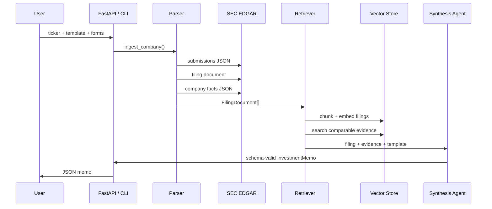

# Architecture

## Agent Responsibilities

Parser agent:

- Resolves ticker symbols to SEC CIKs.
- Reads recent 10-K and 10-Q metadata from `data.sec.gov/submissions`.
- Downloads primary filing documents from the EDGAR archive.
- Pulls XBRL company facts for structured financial metrics.
- Cleans filing HTML and extracts coarse filing sections.

Retrieval agent:

- Chunks filing sections with overlap.
- Embeds chunks with a local sentence-transformer model (`all-MiniLM-L6-v2`, 384-dim, CPU, no API key) for true semantic similarity. Falls back to a deterministic hash embedder only when the model is unavailable (e.g. CI).
- Searches with FAISS `IndexFlatIP` when `faiss-cpu` is installed, with a pure-Python cosine fallback. Embeddings are L2-normalized so inner product equals cosine in both paths.
- Retrieves peer evidence while excluding the target ticker.

Retrieval quality is measured, not assumed. On a labeled multi-sector corpus (`scripts/evaluate_retrieval.py`), semantic embeddings reach MRR 1.00 and recall@3 0.88 vs. 0.32 / 0.29 for the lexical hash baseline — the top-ranked comparable is consistently a true same-sector peer.

Synthesis agent:

- Builds a prompt payload with filing metadata, XBRL metrics, sections, workflow template instructions, and retrieved evidence.
- Uses OpenAI or Anthropic tool calling when API keys are configured.
- Falls back to deterministic synthesis for tests, demos, and offline walkthroughs.
- Validates every result against the `InvestmentMemo` schema.

Workflow orchestrator:

- Runs parser, retrieval, and synthesis as a direct Python workflow.
- Exposes a LangGraph DAG through `build_langgraph()` when `langgraph` is installed.

## Data Flow

## Schema Contract

The central output is `InvestmentMemo`, which requires:

- Recommendation and confidence.
- Filing identity and workflow template.
- Executive summary and business overview.
- Key financial metrics.
- Comparable insights.
- Risks, catalysts, diligence questions.
- Source citations.

The same Pydantic model is exported as OpenAI and Anthropic tool schemas.

## Evaluation

The benchmark checks:

- Schema validity rate.
- Task completion rate.
- Average and p95 latency.
- Presence of citations, risks, financials, and memo sections.

The offline benchmark is intentionally deterministic so the project can be demoed in interviews without API keys.
